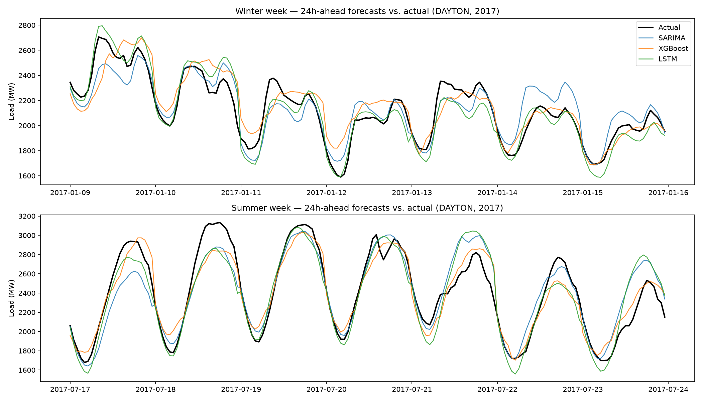

# Electricity Demand Forecasting: ARIMA vs. XGBoost vs. LSTM

Forecasting hourly electricity demand using classical statistical methods, gradient-boosted trees, and deep learning — with an emphasis on honest, leakage-free evaluation rather than leaderboard chasing.


*24-hour-ahead forecasts from all three models against actual load for one winter and one summer week of the 2017 validation year.*

## Why this project

Most forecasting demos compare models on a single random train/test split, which quietly leaks future information into training and inflates results. This project instead uses **walk-forward (expanding window) validation**, the same evaluation logic used in production forecasting and trading systems, to give an honest picture of how each model would have performed if deployed in real time.

## Dataset

[PJM Hourly Energy Consumption](https://www.kaggle.com/datasets/robikscube/hourly-energy-consumption) (Kaggle, public) — hourly electricity load in megawatts for the **DAYTON** sub-region of the PJM grid, spanning **October 2004 – August 2018** (~121,000 hourly readings).

Electricity demand is a strong candidate for this kind of comparison because it has:
- Multiple overlapping seasonalities (daily, weekly, yearly)
- Weather-driven exogenous effects (heating/cooling demand)
- Real, non-random signal — unlike raw asset prices, which are closer to a random walk

## Models compared

| Model | Type | Handles seasonality via |
|---|---|---|
| Naive / Moving Average | Baseline | — |
| SARIMA(X) | Classical statistical | Explicit seasonal AR/MA terms |
| XGBoost | Gradient-boosted trees | Hand-engineered lag & calendar features |
| LSTM | Recurrent neural network | Learned from raw sequence |

## Methodology

1. **EDA** — stationarity testing (ADF/KPSS), ACF/PACF analysis, seasonal decomposition
2. **Preprocessing** — DST gap/duplicate handling, missing value imputation, chronological train/val/test split
3. **Feature engineering** (for XGBoost) — lagged demand (t-1, t-24, t-168), rolling means/stds, hour/day-of-week/month, holiday flags, cyclical hour/month encoding
4. **Evaluation** — walk-forward validation across the full 2017 calendar year; each model forecasts 24 hours ahead once per day. RMSE and MAE computed across all forecasted hours.
5. **Forecast horizon**: 24 hours ahead (day-ahead forecasting), matching how grid operators typically plan.

### Model-specific setup

- **SARIMA(1,0,1)(1,1,1)[24]** — order chosen from ADF/KPSS stationarity tests and ACF/PACF lag structure identified in EDA (see `notebooks/01_eda.ipynb`). Fit on a rolling 2-year training window, refit every 14 days during walk-forward evaluation.
- **XGBoost** — single model using a "horizon-as-feature" design: one model handles all 24 forecast horizons, taking the horizon (1–24) as an input feature alongside lag/rolling/calendar features. Refit every 30 days during evaluation. At each refit, training rows are filtered by *target* time (origin + horizon) rather than origin time, so no training target falls inside the day being forecast.
- **LSTM (PyTorch)** — univariate, 168-hour (1 week) lookback window chosen to match XGBoost's weekly lag feature and give the model equal access to the weekly seasonality found in EDA. Outputs all 24 forecast hours in a single forward pass (no recursive feedback). Trained once on data through end of 2016; **not refit during the validation year** — a deliberate choice, since retraining a neural network as frequently as the classical models would be far more expensive, and periodic (not continuous) retraining is standard practice for deployed neural forecasting models.

## Results

Full 2017 calendar year, DAYTON region, 24-hour-ahead forecasts:

| Model | RMSE (MW) | MAE (MW) | MAE improvement over naive |
|---|---|---|---|
| Naive (same hour, 1 week prior) | 280.15 | 218.15 | — |
| XGBoost | 154.57 | 118.97 | 45.5% |
| SARIMA | 156.27 | 114.17 | 47.7% |
| **LSTM** | **121.30** | **84.68** | **61.2%** |

**Key finding:** The LSTM achieved the best accuracy overall — roughly 26% lower MAE than SARIMA and 29% lower than XGBoost — despite using only raw historical load values as input (no calendar or holiday features, unlike XGBoost) and without being retrained at any point during the validation year. This suggests the LSTM's learned sequence representation captured daily and weekly seasonal structure that the other two approaches needed to be given more explicitly (SARIMA via its seasonal order, XGBoost via hand-engineered calendar features).

SARIMA and XGBoost performed similarly overall (114 vs. 119 MAE), with SARIMA holding a slight edge — notable given XGBoost had access to richer features (calendar, holiday, multiple lags) while SARIMA relies purely on its own autoregressive/seasonal structure.

### XGBoost error by forecast horizon

XGBoost's error is not uniform across the 24-hour horizon — it's lowest during overnight hours and highest during the two daily demand transition periods:

| Period | Horizon (hours ahead) | Approx. MAE (MW) |
|---|---|---|
| Overnight (stable, low demand) | 1–4 (00:00–03:00) | 58–82 |
| Morning ramp-up | 8–10 (07:00–09:00) | 134–159 |
| Evening peak/decline | 17–21 (16:00–20:00) | 136–155 |

Full per-horizon RMSE/MAE is in `results/xgboost_per_horizon.csv`.

**Interpretation:** the model struggles most when demand is changing rapidly and performs best when demand is flat — consistent with how grid operators describe day-ahead forecasting difficulty in practice. This points to a concrete, testable improvement: adding rate-of-change features (e.g., recent hour-over-hour deltas) rather than only level-based lags and rolling stats, which could help the model recognize when it's entering a ramp period.

**Caveat:** because every forecast is issued at midnight, horizon and hour-of-day are the same thing in this setup, so this table can't fully separate "hard hours" from "far-ahead hours." Horizon 24 (23:00, the farthest step) has the highest MAE of all (160 MW), which suggests distance from the last observation contributes too. Issuing forecasts from several different origin hours would separate the two effects.

## Repo structure

```
├── data/raw/                  # Kaggle CSVs (git-ignored; downloaded by data_pipe.py)
├── notebooks/
│   └── 01_eda.ipynb           # stationarity tests, ACF/PACF, decomposition
├── src/
│   ├── data_pipe.py           # Kaggle download + per-region loader
│   ├── data_preprocessing.py  # DST gap fixing, outlier flags, chronological split
│   ├── features.py            # lag / rolling / calendar features for XGBoost
│   ├── plot_results.py        # builds the forecast comparison figure
│   └── models/
│       ├── sarima_model.py    # SARIMA + naive baseline, walk-forward
│       ├── xgboost_model.py   # horizon-as-feature XGBoost, walk-forward
│       └── lstm_model.py      # PyTorch LSTM, trained once, walk-forward eval
└── results/                   # forecast CSVs, per-horizon metrics, figures
```

## Setup

```bash
git clone https://github.com/[username]/electricity-demand-forecasting.git
cd electricity-demand-forecasting
pip install -r requirements.txt
python src/data_pipe.py              # downloads dataset via Kaggle API (needs ~/.kaggle/kaggle.json)
python src/data_preprocessing.py     # cleans data, verifies chronological split
python src/models/sarima_model.py    # SARIMA + naive baseline walk-forward (slowest, refits every 14 days)
python src/models/xgboost_model.py   # XGBoost walk-forward + per-horizon breakdown
python src/models/lstm_model.py      # trains and evaluates the LSTM
python src/plot_results.py           # regenerates results/figures/forecast_comparison.png
```

All scripts are run from the repo root.

## What I'd extend next

- **Add rate-of-change features to XGBoost** (e.g., 1-3 hour deltas, recent slope) to directly address the ramp-period weakness identified above — the clearest, most concrete next step from this analysis.
- **Use target-time calendar features in XGBoost** — calendar and holiday flags currently describe the forecast origin (23:00 the night before), so the model can't tell when the day it's forecasting is a holiday.
- **Add calendar/exogenous features to the LSTM** (hour, day-of-week, holiday flags concatenated at each timestep) to see whether it closes the gap further or whether its current univariate performance is close to a ceiling.
- **Add weather data (temperature)** as an exogenous regressor for SARIMAX and XGBoost — heating/cooling demand is a major real-world driver of electricity load that none of the current models have access to.
- **Periodic LSTM retraining** (e.g., quarterly) during the validation year, to see how much the "train once" simplification cost in accuracy versus the classical models' frequent refitting.
- Probabilistic forecasting (prediction intervals) instead of point forecasts.
- Multi-region joint modeling across the other PJM sub-regions in the dataset.

## Author

Christian Ceja — Applied Math, UC Berkeley.
